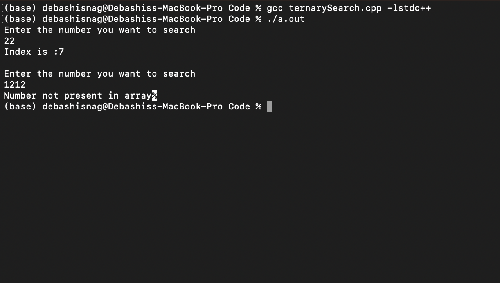

# Execution
To compile the ternarySearch code run the bellow command in the Terminal
```
$ gcc ternarySearch.cpp -lstdc++ -o ternarySearch.out
```


It will create an a.out file in the same folder. Run the file.

```
$./ternarySearch.out
```


The int array is defined and initialized with the following value
{3, 4, 7, 10, 11, 13, 19, 22, 25, 34, 34, 56, 77, 84, 84, 91}

After running the file it will prompt user to enter the number. 

Enter a number which is present in the array. Say user entered - 22. It will print the below message -
$ Index is : 7

Enter a number which is not present in the array. Say user entered - 1212. It will print the below message -
$ Number not present in array





